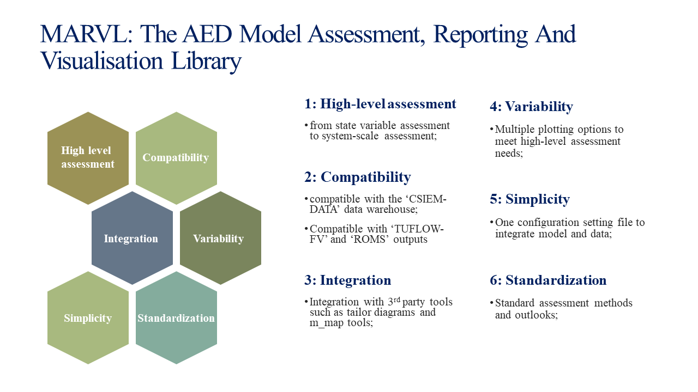

[](https://www.repostatus.org/#wip)

# csiem-marvl



## Overview
MARVL is an integrated software package for visualizing the model outputs and observational datasets, and evaluating the model performance. One of the key challenges for water quality modelling is to assess the model performance against field observations that typically include plenty of biogeochemical variables, exist at multiple sites, and are provided by multiple agencies in different formats. To handle this challenge, the AED research group has developed a series of data processing framework to store the data in a uniform format that is compatible to the AED outputs. At the same time, the group has developed a series of model assessment methods and scripts that were specifically designed to be compatible with the AED data repository and model outputs. The repository is a collection of AED inhouse scripts that have been developed during previous research projects, and has been refined with uniform and easier user interfaces. At the moment, the AED-MARVL was designed with the following features:
- Multiple visualizing options such as time-series, transect view, curtain view, site profiling;
- Standard and advanced performance evaluating methods;
- One configuration file for all options;
- Uniform outlook (e.g. font style and size, figure resolution) of the figures and animations;
- Option to use YAML style of configurations that can be shared with other plotting software such as R and python;

Following plotting options are available in MARVL: 
- Time series (with options to show observational data and perform model skill assessment);
- Transect (with options to show observational data on the same transect);
- Transect stacked area for comparing water quality compositions;
- Transect exceedance for comparing water quality levels against guidelines;
- Site profiling of selected water quality variables;
- Nutrient budgeting;
- Sheet plotting and animations;
- Curtain plotting and animations;

The plotting functions have been tested within several case studies, including Coorong Lagoon, Cockburn Sound, and Lake Erie, and  examples are included in the current repository. However, MARVL is still in its developing phase. We are expecting feedbacks for us to improve the user experience, as well as functionalities.

## Repository Organisation
- `Common`: place holder for common files such as unit conversion and agency information;
- `Matlab`: matlab plotting scripts and libraries for MARVL;
- `Project`: site-specific configurations and recommended place for plotting results;
- `R`: place holder for future development in R environment;
- `Documents`: place holder for documenting MARVL science and user instructions;

## Execution Instruction
- Colone the `csiem-marvl` repository onto local computer
- Open Matlab (version 2020 or later versions), go to the local `csiem-marvl` folder and  add the paths to tools/libraries by entering
 ```
 addpath(genpath('./'))
 ```
- Go to `csiem-marvl/{your project}/` folder, edit the `MARVL.m` to configure the plots (use the 'MARVL.m' under other project folder as templates);
- Under the `csiem-marvl/{your project}/` path, start the plotting by entering
 ```
  run_AEDmarvl('./MARVL.m','matlab')
 ```
   or if you wish to use YAML style configuration
 ```
   run_AEDmarvl('./MARVL.m','yaml')
 ```


 